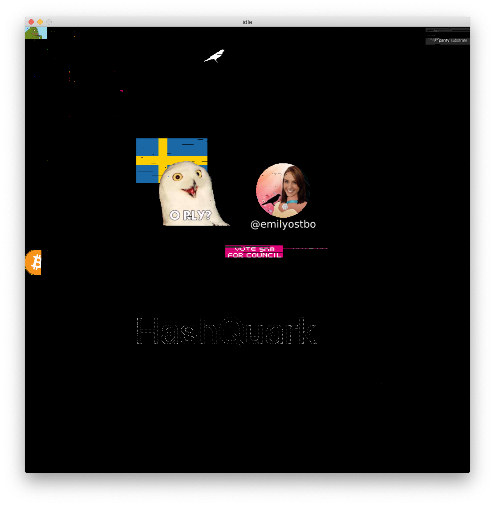

  <h1><code>remarkable-oxide</code></h1>

  

    <strong>A rust implementation of the Kusama <a href="https://kusama.network/remarkable/">remarkable page</a></strong>
  

  

# Building and Running

## Prerequisites

### SDL2

Make sure that you have SDL2 installed. For macOS I had to install SDL2:

    brew install sdl2

You might also need to put it in library path

    export LIBRARY_PATH="$LIBRARY_PATH:/usr/local/lib"

For ubuntu/debian you would need to execute something like following:

    apt install libsdl2-dev

### RPC Node

You would also need a running kusama node (polkadot or a substrate chain might also work) that serves WebSocket RPC at the port 1234. You can launch kusama/polkadot node using:

    polkadot --ws-port 1234

## Building

In order to compile and run the project, type

    cargo run --release

Then, make sure that you also have kusama running (polkadot or a substrate chain might also work) and serves WebSocket RPC at the port 1234, for example:

    polkadot --ws-port 1234

## Cross-compilation to Linux Arm

This project is initially targeted to be used in Raspberry Pi. To cross compile, you can launch docker and then execute the following:

    ./cross-build.sh

Then you will be able to find the binary at `./target/armv7-unknown-linux-gnueabihf/release/remarkable-oxide`.
